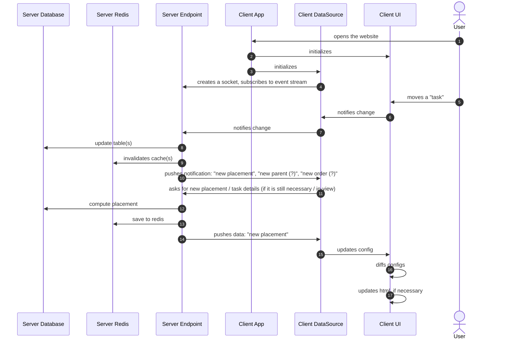

# Sequence

Sequence diagrams are best for presenting ordered series of interactions between two or more participants or actors.

## Syntax

There are syntactical rules that each valid sequence diagram should comply with.

### Definition

```ebnf
(* FUNDEMANTALS *)
ALIAS    ::= (WORD | DIGIT | SPACE)+
TEXT     ::= (WORD | DIGIT | SPACE)+
LIFELINE ::= WORD

(* DECLARATIONS *)
BOX ::= ""

(* STATEMENTS *)
LIFELINE_DECL ::= ( "participant" | "actor" ) LIFELINE [ "as" ALIAS ]
MESSAGE       ::= LIFELINE "->>" LIFELINE [ ":" TEXT ]
ACTIVATE      ::= "activate" LIFELINE
DEACTIVATE    ::= "deactivate" LIFELINE
CREATE        ::= "create" LIFELINE_DECL
DESTROY       ::= "destroy" LIFELINE

(* THE DIAGRAM *)
DECLARATION ::= ( BOX )
STATEMENT   ::= ( LIFELINE_DECL | MESSAGE | CREATE | DESTROY |  )
DIAGRAM     ::= "sequenceDiagram" ["autoNumber"] { DECLARATION } { STATEMENT }
```

### Example



## Components

Sequence diagrams are mainly consist of series of lifelines laid out at the horizontal axis and the messages between them laid out at the vertical axis in the order of code.

### Lifelines

Both of the participants and actors involved in a sequence diagram are called lifelines. They are the both ends of each message in the diagram. They are either declared at the start of diagram, or created and destroyed during the sequence proceed following the message performs the action. Multiple lifelines can be wrapped with a box to group them in the render.

#### Declare

Lifelines are declared as either **participant** or **actor** with or without aliasing. Aliases lets you refer to the lifeline using shorter names (such as initials) later in the diagram code without the head box text losing its descriptiveness. Declaring lifelines is not required. Mentioning messages trigger implicit lifeline declaration with defaults.

```mermaid
participant AppServer
participant ws as WebServer
actor Alice
actor b as Bob
```

#### Create, destroy

A create command followed by a message is rendered as the target lifeline created in the midway of sequence as a result of the interaction represented with the message. A destroy command following a message will make the source lifeline to be terminated with the message.

```mermaid
create participant ws as WebServer
as->>ws: Up

destroy ws
ws->>as: Return
```

#### Activate, deactivate

Activating a lifeline is represented as a rectangle starts from the first message following the command and extends to the bottom at the vertical axis ("lifeline track") where the message following deactivate command is placed. So, activate commands needs to be paired with a following deactivate command on the same lifeline. When activations are nested, rectangles will be stacked at the output.

```mmd
activate bob
alice->>bob: Hi, Bob!
bob->>alice: Hi, Alice!
deactivate bob
```

#### Group

Boxes can be used to group 2 or more lifelines and their belongings within a rounded box. Background color of the box can be customized with providing a HEX code before the title.

```mmd
box #ff0000 Participants
  participant AppServer
  participant WebServer
end

box #0000ff Actors
  actor a as Alice
  actor b as Bob
end
```

### Messages

Messages represent the interactions between lifelines. They are drawn with an arrow originates from the source and land on the destination which are the lifelines on the left and right hand side of the arrow. Messages are better when they are annotated with text.

```mmd
alice->>bob: Hi Bob!
```

Lifelines can be activated and deactivated using messages as a shortcut. The plus symbol following the arrow activates the destination lifeline; minus sign deactivates the source lifeline.

```mmd
alice->>+bob: 2 * 2 Bob?
note over bob: Bob thinks...
bob->>-alice: 4 Bob!
```

### Note

Notes are for either one or two lifelines. The single lifeline notes must be positioned to the track with keywords `left of`, `right of` or `over`. The two lifeline notes are always placed automatically; touching the both tracks.

```mmd
note left of  alice: To be...
note over     alice: ...or not...
note right of alice: to be.
```

### Control flow

All control flow commands are blocks; they all need to be terminated with an `end` statement. Some support multiple cases. They all posses a title (or description) field that is drawn at the top-center of the bounding box. They all styled same with only differentiating factor being the block's type written on the top-left of the bounding box.

#### Break

`break`

#### Loop

`loop`

#### Critical

`critical`

#### Option

`option`

#### Parallel

`parallel`

#### Alt

`alt`

## Comparisons

### Mermaid

The Diagrammer's sequence diagram syntax is based on the Mermaid diagrams with some slight adjustments. Diagrammer doesn't support edge cases of Mermaid feature set and strictly mandates some rules makes the code explicit.

**Syntactical**

- Lifelines should be explicitly declared prior to messages and other constructs mention them via either `participate`, `actor` or `create`.
- All arrows in messages are drawn solid. Dashing options are not available.
- Only the HEX codes starts with a `#` and are 3-8 characters long are recognized as color codes.
- All note blocks needs to contain positioning. There is no defaulting to `over`.
- Diagrammer can create the diagram without some blocks are given titles, descriptions are message contents. Any text following `:` (and the symbol itself) is optional.

## Output

Diagrammer outputs a CSS-grid based HTML structure which can be customized using CSS for its aesthetics to cohere with the brand identity. Make sure your selectors are bound by the interface promise. Feature versions of Diagrammer can make harsh adjustments on the structure of produced HTML except the following selectors are promised to be kept for longer period of time up to date.

### Structure

```html
<div class="diagrammer sequence"><!-- ... --></div>
<style></style>
```
